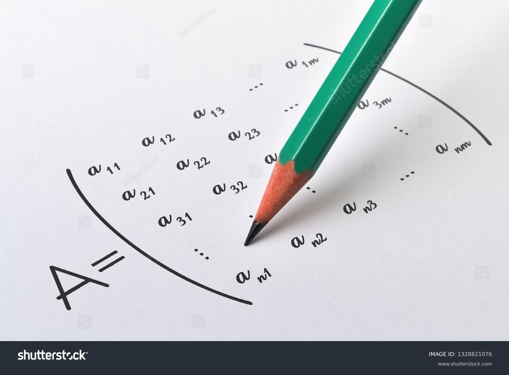
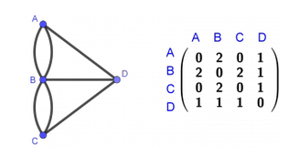
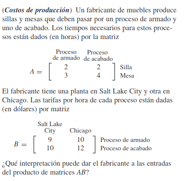

---
### Diapositiva 1: Aplicaciones de las Matrices

**Aplicaciones de las Matrices**

- **Ingeniería**: Usadas para el análisis de estructuras, sistemas de control y simulaciones.
- **Ciencias de la Computación**: Algoritmos gráficos, procesamiento de imágenes, y redes neuronales.
- **Economía**: Modelos de análisis económico, optimización de recursos y análisis de riesgos.
- **Física**: Representación de ecuaciones en dinámica y mecánica cuántica.

---

---
### Diapositiva 4: Aplicaciones Avanzadas de las Matrices

**Aplicaciones Avanzadas de las Matrices**

- **Redes Sociales**: Utilizadas para el análisis de conexiones entre usuarios y recomendaciones de amistades.
- **Procesamiento de Señales**: Aplicadas en la compresión de audio y video, filtrado de señales y reconocimiento de voz.
- **Aprendizaje Automático**: Matrices son fundamentales en algoritmos de aprendizaje automático como la regresión lineal y las redes neuronales.
- **Criptografía**: Matrices se utilizan en algoritmos de cifrado y descifrado para garantizar la seguridad de la información.

---

### Nomenclatura y Definición de Matrices

**Nomenclatura y Dimensiones de las Matrices**

- **Matriz**: Un arreglo rectangular de números dispuestos en filas y columnas.
- **Elementos de una matriz**: $ a_{ij} $ representa el elemento en la i-ésima fila y j-ésima columna.
- **Dimensiones de una matriz**: Si una matriz tiene m filas y n columnas, se describe como una matriz de $ m 	imes n $.

**Ejemplo de Matriz**:
$$ A = \begin{bmatrix}
1 & 2 & 3 \\
4 & 5 & 6
\end{bmatrix} $$
Esta es una matriz de $ 2 	\times 3 $.

---
###  Operaciones con Matrices

**Operaciones Básicas con Matrices**

- **Suma de Matrices**: Las matrices se suman elemento por elemento.
  $$ \begin{bmatrix} 1 & 3 \\ 1 & 0 \end{bmatrix} + \begin{bmatrix} 0 & 0 \\ 7 & 5 \end{bmatrix} = \begin{bmatrix} 1 & 3 \\ 8 & 5 \end{bmatrix} $$

- **Multiplicación por un Escalar**: Todos los elementos de la matriz se multiplican por el escalar.
  $$ 3 	\times \begin{bmatrix} 1 & 3 \\ 1 & 0 \end{bmatrix} = \begin{bmatrix} 3 & 9 \\ 3 & 0 \end{bmatrix} $$

- **Multiplicación de Matrices**: El elemento en la posición (i, j) del producto es el producto punto de la fila i de la primera matriz y la columna j de la segunda matriz.
  $$ \begin{bmatrix} 1 & 2 \\ 3 & 4 \end{bmatrix} 	\times \begin{bmatrix} 2 & 0 \\ 1 & 2 \end{bmatrix} = \begin{bmatrix} 4 & 4 \\ 10 & 8 \end{bmatrix} $$

---

La multiplicación de matrices se define como sigue:

$$
(C)_{ij} = \sum_{k=1}^n A_{ik} B_{kj}
$$

Donde:

  + $A$ es una matriz de dimensiones $m \times n$
  + $B$ es una matriz de dimensiones $n \times p$
  + $C$ es la matriz resultante de dimensiones $m \times p$
  + $i$ es el índice de fila para la matriz resultante $C$
  + $j$ es el índice de columna para la matriz resultante $C$
  + $k$ es el índice de suma que recorre las columnas de $A$ y las filas de $B$

**Ejemplo**

Supongamos que queremos multiplicar las siguientes matrices $A$ y $B$:

$$
A = \begin{bmatrix}
1 & 2 \\
3 & 4
\end{bmatrix}, \quad B = \begin{bmatrix}
2 & 0 \\
1 & 2
\end{bmatrix}
$$

La matriz resultante $C$ se calcularía como:

$$
C = \begin{bmatrix}
(1 \cdot 2 + 2 \cdot 1) & (1 \cdot 0 + 2 \cdot 2) \\
(3 \cdot 2 + 4 \cdot 1) & (3 \cdot 0 + 4 \cdot 2)
\end{bmatrix} = \begin{bmatrix}
4 & 4 \\
10 & 8
\end{bmatrix}
$$

---

### Producto punto

Sea $x$ un vector de tamaño $n$ y $y$ un vector de tamaño $n$. El producto punto entre $x$ y $y$ se define como:

$$ x \cdot y = \sum_{i=1}^n x_i y_i $$

**Aplicación**
(Aplicación: cálculo de la calificación promedio de un curso) Suponga que un profesor utiliza cuatro notas para determinar la calificación promedio que obtiene un estudiante en un curso: cuestionarios, dos exámenes de una hora y un examen final. Cada una de estas notas tiene una ponderación de 10, 30, 30 y 30%, respectivamente. Si las calificaciones de un estudiante son, en cada rubro, 78, 84, 62 y 85, podemos calcular el promedio del curso haciendo

$$w=\begin{bmatrix}0.1 \\ 0.3 \\ 0.3 \\ 0.3\end{bmatrix}$$
$$x=\begin{bmatrix}78 \\ 84 \\ 62 \\ 85\end{bmatrix}$$

$$w \cdot x = 0.1 \cdot 78 + 0.3 \cdot 84 + 0.3 \cdot 62 + 0.3 \cdot 85 = 77.1$$

---

### Definición de Matriz Transpuesta

La **matriz transpuesta** de una matriz $A$, denotada como $A^T$, se define como la matriz obtenida al intercambiar las filas por columnas de $A$. Si $A$ es una matriz de dimensiones $m \times n$, entonces $A^T$ tendrá dimensiones $n \times m$. Matemáticamente, esto se puede escribir como:

$$
(A^T)_{ij} = A_{ji}
$$

donde $i$ y $j$ representan índices de filas y columnas respectivamente.

### Definición de Matriz Simétrica

Una **matriz simétrica** es una matriz cuadrada $A$ que es igual a su transpuesta, es decir, $A = A^T$. Esto implica que los elementos de la matriz son simétricos respecto a su diagonal principal. Formalmente, una matriz $A$ es simétrica si:

$$
A_{ij} = A_{ji}
$$

para todos los índices $i$ y $j$. Esto significa que el elemento en la fila $i$ y columna $j$ es igual al elemento en la fila $j$ y columna $i$.

---

### Definición de Matriz Identidad

La **matriz identidad** $I$, de tamaño $n \times n$, es una matriz cuadrada que tiene todos sus elementos iguales a 0 excepto los de la diagonal principal, que son iguales a 1. Esto se puede expresar como:

$$
I_{ij} = 
\begin{cases} 
1 & \text{si } i = j \\
0 & \text{si } i \neq j
\end{cases}
$$

donde $i$ y $j$ son los índices de las filas y las columnas, respectivamente. La matriz identidad actúa como el elemento neutro en la multiplicación de matrices, es decir, para cualquier matriz $A$ de tamaño $n \times n$, se cumple que:

$$
AI = IA = A
$$
---

### Definición de Matriz Inversa

La **matriz inversa** de una matriz cuadrada $A$, denotada como $A^{-1}$, es aquella que, cuando se multiplica por $A$, resulta en la matriz identidad $I$. Esto se expresa como:

$$
AA^{-1} = A^{-1}A = I
$$

Para que una matriz $A$ tenga inversa, debe ser cuadrada y su determinante no debe ser cero. La matriz inversa se utiliza para resolver sistemas de ecuaciones lineales y en la teoría de transformaciones lineales.

---

### Ejemplo de Matriz Inversa

Considere la matriz $A$:

$$
A = \begin{bmatrix}
1 & 2 \\
3 & 4
\end{bmatrix}
$$

La matriz inversa es 
$$
A^{-1} = \begin{bmatrix}
-2 & 1 \\
1.5 & -0.5
\end{bmatrix}
$$

---

### Problema de Costos de Producción

---

---

### Combinaciones lineales

Una combinación lineal de un conjunto de vectores $\{v_1, v_2, \ldots, v_n\}$ es una expresión de la forma:

$$ c_1 v_1 + c_2 v_2 + \ldots + c_n v_n $$

Donde $c_1, c_2, \ldots, c_n$ son escalares.

**Ejemplo de combinación lineal**

### Ejemplo de Combinación Lineal de Vectores de Tres Dimensiones

Consideremos los siguientes vectores en $\mathbb{R}^3$:

$$
\mathbf{v}_1 = \begin{pmatrix}
1 \\
2 \\
3
\end{pmatrix}, \quad \mathbf{v}_2 = \begin{pmatrix}
4 \\
5 \\
6
\end{pmatrix}, \quad \mathbf{v}_3 = \begin{pmatrix}
7 \\
8 \\
9
\end{pmatrix}
$$

Una **combinación lineal** de estos vectores se forma al tomar escalares $\alpha, \beta, \gamma$, que pueden ser cualquier número real, y combinar los vectores de la siguiente manera:

$$
\alpha \mathbf{v}_1 + \beta \mathbf{v}_2 + \gamma \mathbf{v}_3
$$

Por ejemplo, si elegimos $\alpha = 1$, $\beta = -2$, y $\gamma = 3$, la combinación lineal sería:

$$
1 \cdot \begin{pmatrix}
1 \\
2 \\
3
\end{pmatrix} - 2 \cdot \begin{pmatrix}
4 \\
5 \\
6
\end{pmatrix} + 3 \cdot \begin{pmatrix}
7 \\
8 \\
9
\end{pmatrix} = \begin{pmatrix}
1 \cdot 1 - 2 \cdot 4 + 3 \cdot 7 \\
1 \cdot 2 - 2 \cdot 5 + 3 \cdot 8 \\
1 \cdot 3 - 2 \cdot 6 + 3 \cdot 9
\end{pmatrix} = \begin{pmatrix}
14 \\
13 \\
12
\end{pmatrix}
$$

Este resultado, $\begin{pmatrix}
14 \\
13 \\
12
\end{pmatrix}$, es un vector en $\mathbb{R}^3$ que es una combinación lineal de $\mathbf{v}_1$, $\mathbf{v}_2$, y $\mathbf{v}_3$ con los coeficientes 1, -2, y 3 respectivamente.

## Sistema de ecuaciones lineales

Un **sistema de ecuaciones lineales** es un conjunto de ecuaciones lineales que comparten las mismas variables. Un sistema de ecuaciones lineales puede tener una o más soluciones, dependiendo de la cantidad de ecuaciones y variables. Un sistema de ecuaciones lineales se puede representar de la siguiente manera:

$$ a_{11} x_1 + a_{12} x_2 + \ldots + a_{1n} x_n = b_1 $$
$$ a_{21} x_1 + a_{22} x_2 + \ldots + a_{2n} x_n = b_2 $$
$$ \vdots $$
$$ a_{m1} x_1 + a_{m2} x_2 + \ldots + a_{mn} x_n = b_m $$
Donde:

  + $a_{ij}$ son los coeficientes de las variables
  + $x_i$ son las variables
  + $b_i$ son los términos constantes
  + $m$ es el número de ecuaciones
  + $n$ es el número de variables

### Ejemplo de Sistema de Ecuaciones Lineales

Considere el siguiente sistema de ecuaciones lineales:

$$ 2x + 3y = 7 $$
$$ 4x - y = 7 $$

Para resolver este sistema, podemos usar el método de eliminación o sustitución. En este caso, podemos resolver el sistema de ecuaciones lineales para encontrar que $x = 2$ y $y = 1$.

Note que el vector 

$$2\begin{pmatrix}2 \\
 4\end{pmatrix}+1\begin{pmatrix}3\\-1\end{pmatrix}=\begin{pmatrix}7\\7\end{pmatrix}$$

¿Qué significa esto?
¿Como podemos encontrar la solcuión de un sistema de ecuaciones lineales?

## Ejemplo 2
veamos otro ejemplo

$$ 3x + 2y = 11 $$
$$ 2x - y = 5 $$
$$ 5x + 3y = 18 $$

Note que el vector 

$$2\begin{pmatrix}3 \\ 2\\ 5
 \end{pmatrix}+1\begin{pmatrix}2\\-1\\ 3\end{pmatrix}=\begin{pmatrix}11\\5\\18\end{pmatrix}$$

Note que podemos encontrar la solución de un sistema de ecuaciones lineales como una combinación lineal de los vectores que representan las ecuaciones. 

Podemos estudiar sistemas de diferentes dimensiones. Aunque, en primera parte de este curso nos enfocaremos en sistemas cuadrados. es decir, que tengan el mismo numero de filas y columnas.

### Solución de un Sistema de Ecuaciones Lineales

+ Sustitución
+ Eliminación
+ Reducción

### solución de un sistema de ecuaciones lineales triangular 

Ejemplo:

$$  3x + 2y + z = 1 $$
$$  0x - 2y + 2z = 2 $$
$$  0x + 0y + 5z = 5 $$

Para resolver este sistema encontramos la solución de la tercera ecuación y sustituimos en la segunda ecuación y luego en la primera ecuación.

### Ejercicio

Resuelva el siguiente sistema de ecuaciones lineales:

$$ 2x + 3y +z -w= 7 $$
$$ 0x - 2y + 2z +w = 2 $$
$$ 0x + 0y + 5z -w = 5 $$
$$ 0x + 0y + 0z +w = 1 $$

### Operaciones elementales de matrices

Las operaciones elementales de matrices son operaciones que se pueden realizar en las filas de una matriz sin cambiar la solución de un sistema de ecuaciones lineales. Estas operaciones incluyen:

+ Intercambiar dos filas
+ Multiplicar una fila por un escalar no nulo
+ Sumar un múltiplo de una fila a otra fila

Estas operaciones se utilizan para simplificar una matriz y facilitar la resolución de un sistema de ecuaciones lineales.

### Ejemplo de Operaciones Elementales de Matrices

Considere la siguiente matriz:

$$
\begin{bmatrix}

1 & 2 & 3 \\

4 & 5 & 6 \\

7 & 8 & 9

\end{bmatrix}

¿Cómo podemos usar las operaciones elementales para solucionar un sistema de ecuaciones lineales?

