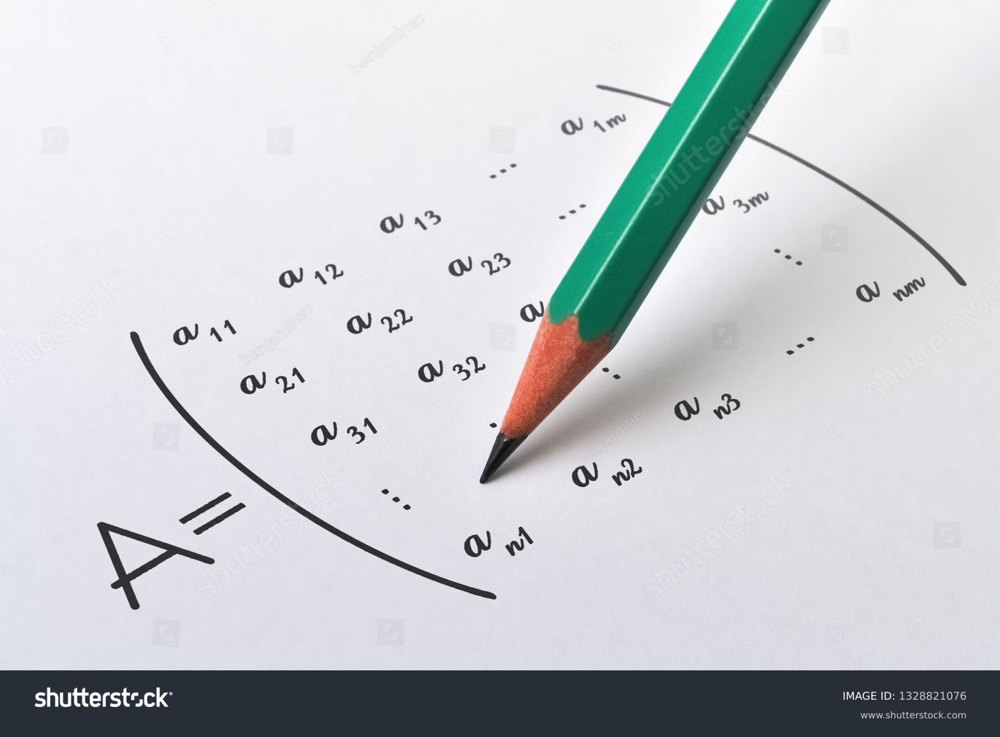
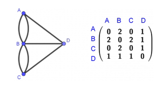
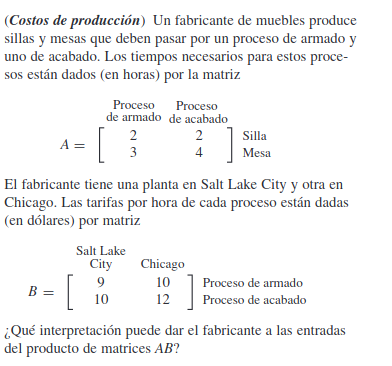

---
### Diapositiva 1: Aplicaciones de las Matrices

**Aplicaciones de las Matrices**

- **Ingeniería**: Usadas para el análisis de estructuras, sistemas de control y simulaciones.
- **Ciencias de la Computación**: Algoritmos gráficos, procesamiento de imágenes, y redes neuronales.
- **Economía**: Modelos de análisis económico, optimización de recursos y análisis de riesgos.
- **Física**: Representación de ecuaciones en dinámica y mecánica cuántica.

---

---
### Diapositiva 4: Aplicaciones Avanzadas de las Matrices

**Aplicaciones Avanzadas de las Matrices**

- **Redes Sociales**: Utilizadas para el análisis de conexiones entre usuarios y recomendaciones de amistades.
- **Procesamiento de Señales**: Aplicadas en la compresión de audio y video, filtrado de señales y reconocimiento de voz.
- **Aprendizaje Automático**: Matrices son fundamentales en algoritmos de aprendizaje automático como la regresión lineal y las redes neuronales.
- **Criptografía**: Matrices se utilizan en algoritmos de cifrado y descifrado para garantizar la seguridad de la información.

---

### Nomenclatura y Definición de Matrices

**Nomenclatura y Dimensiones de las Matrices**

- **Matriz**: Un arreglo rectangular de números dispuestos en filas y columnas.
- **Elementos de una matriz**: $ a_{ij} $ representa el elemento en la i-ésima fila y j-ésima columna.
- **Dimensiones de una matriz**: Si una matriz tiene m filas y n columnas, se describe como una matriz de $ m 	imes n $.

**Ejemplo de Matriz**:
$$ A = \begin{bmatrix}
1 & 2 & 3 \\
4 & 5 & 6
\end{bmatrix} $$
Esta es una matriz de $ 2 	\times 3 $.

---
###  Operaciones con Matrices

**Operaciones Básicas con Matrices**

- **Suma de Matrices**: Las matrices se suman elemento por elemento.
  $$ \begin{bmatrix} 1 & 3 \\ 1 & 0 \end{bmatrix} + \begin{bmatrix} 0 & 0 \\ 7 & 5 \end{bmatrix} = \begin{bmatrix} 1 & 3 \\ 8 & 5 \end{bmatrix} $$

- **Multiplicación por un Escalar**: Todos los elementos de la matriz se multiplican por el escalar.
  $$ 3 	\times \begin{bmatrix} 1 & 3 \\ 1 & 0 \end{bmatrix} = \begin{bmatrix} 3 & 9 \\ 3 & 0 \end{bmatrix} $$

- **Multiplicación de Matrices**: El elemento en la posición (i, j) del producto es el producto punto de la fila i de la primera matriz y la columna j de la segunda matriz.
  $$ \begin{bmatrix} 1 & 2 \\ 3 & 4 \end{bmatrix} 	\times \begin{bmatrix} 2 & 0 \\ 1 & 2 \end{bmatrix} = \begin{bmatrix} 4 & 4 \\ 10 & 8 \end{bmatrix} $$

---

La multiplicación de matrices se define como sigue:

$$
(C)_{ij} = \sum_{k=1}^n A_{ik} B_{kj}
$$

Donde:

  + $A$ es una matriz de dimensiones $m \times n$
  + $B$ es una matriz de dimensiones $n \times p$
  + $C$ es la matriz resultante de dimensiones $m \times p$
  + $i$ es el índice de fila para la matriz resultante $C$
  + $j$ es el índice de columna para la matriz resultante $C$
  + $k$ es el índice de suma que recorre las columnas de $A$ y las filas de $B$

**Ejemplo**

Supongamos que queremos multiplicar las siguientes matrices $A$ y $B$:

$$
A = \begin{bmatrix}
1 & 2 \\
3 & 4
\end{bmatrix}, \quad B = \begin{bmatrix}
2 & 0 \\
1 & 2
\end{bmatrix}
$$

La matriz resultante $C$ se calcularía como:

$$
C = \begin{bmatrix}
(1 \cdot 2 + 2 \cdot 1) & (1 \cdot 0 + 2 \cdot 2) \\
(3 \cdot 2 + 4 \cdot 1) & (3 \cdot 0 + 4 \cdot 2)
\end{bmatrix} = \begin{bmatrix}
4 & 4 \\
10 & 8
\end{bmatrix}
$$

---

### Producto punto

Sea $x$ un vector de tamaño $n$ y $y$ un vector de tamaño $n$. El producto punto entre $x$ y $y$ se define como:

$$ x \cdot y = \sum_{i=1}^n x_i y_i $$

**Aplicación**
(Aplicación: cálculo de la calificación promedio de un curso) Suponga que un profesor utiliza cuatro notas para determinar la calificación promedio que obtiene un estudiante en un curso: cuestionarios, dos exámenes de una hora y un examen final. Cada una de estas notas tiene una ponderación de 10, 30, 30 y 30%, respectivamente. Si las calificaciones de un estudiante son, en cada rubro, 78, 84, 62 y 85, podemos calcular el promedio del curso haciendo

$$w=\begin{bmatrix}0.1 \\ 0.3 \\ 0.3 \\ 0.3\end{bmatrix}$$
$$x=\begin{bmatrix}78 \\ 84 \\ 62 \\ 85\end{bmatrix}$$

$$w \cdot x = 0.1 \cdot 78 + 0.3 \cdot 84 + 0.3 \cdot 62 + 0.3 \cdot 85 = 77.1$$

---

### Definición de Matriz Transpuesta

La **matriz transpuesta** de una matriz $A$, denotada como $A^T$, se define como la matriz obtenida al intercambiar las filas por columnas de $A$. Si $A$ es una matriz de dimensiones $m \times n$, entonces $A^T$ tendrá dimensiones $n \times m$. Matemáticamente, esto se puede escribir como:

$$
(A^T)_{ij} = A_{ji}
$$

donde $i$ y $j$ representan índices de filas y columnas respectivamente.

### Definición de Matriz Simétrica

Una **matriz simétrica** es una matriz cuadrada $A$ que es igual a su transpuesta, es decir, $A = A^T$. Esto implica que los elementos de la matriz son simétricos respecto a su diagonal principal. Formalmente, una matriz $A$ es simétrica si:

$$
A_{ij} = A_{ji}
$$

para todos los índices $i$ y $j$. Esto significa que el elemento en la fila $i$ y columna $j$ es igual al elemento en la fila $j$ y columna $i$.

---

### Definición de Matriz Identidad

La **matriz identidad** $I$, de tamaño $n \times n$, es una matriz cuadrada que tiene todos sus elementos iguales a 0 excepto los de la diagonal principal, que son iguales a 1. Esto se puede expresar como:

$$
I_{ij} = 
\begin{cases} 
1 & \text{si } i = j \\
0 & \text{si } i \neq j
\end{cases}
$$

donde $i$ y $j$ son los índices de las filas y las columnas, respectivamente. La matriz identidad actúa como el elemento neutro en la multiplicación de matrices, es decir, para cualquier matriz $A$ de tamaño $n \times n$, se cumple que:

$$
AI = IA = A
$$
---
### Definición de Matriz Inversa

La **matriz inversa** de una matriz cuadrada $A$, denotada como $A^{-1}$, es aquella que, cuando se multiplica por $A$, resulta en la matriz identidad $I$. Esto se expresa como:

$$
AA^{-1} = A^{-1}A = I
$$

Para que una matriz $A$ tenga inversa, debe ser cuadrada y su determinante no debe ser cero. La matriz inversa se utiliza para resolver sistemas de ecuaciones lineales y en la teoría de transformaciones lineales.

---

### Ejemplo de Matriz Inversa

Considere la matriz $A$:

$$
A = \begin{bmatrix}
1 & 2 \\
3 & 4
\end{bmatrix}
$$

La matriz inversa es 
$$
A^{-1} = \begin{bmatrix}
-2 & 1 \\
1.5 & -0.5
\end{bmatrix}
$$

---

### Problema de Costos de Producción

---

---
### Combinaciones lineales

Una combinación lineal de un conjunto de vectores $\{v_1, v_2, \ldots, v_n\}$ es una expresión de la forma:

$$ c_1 v_1 + c_2 v_2 + \ldots + c_n v_n $$

Donde $c_1, c_2, \ldots, c_n$ son escalares.

**Ejemplo de combinación lineal**

### Ejemplo de Combinación Lineal de Vectores de Tres Dimensiones

Consideremos los siguientes vectores en $\mathbb{R}^3$:

$$
\mathbf{v}_1 = \begin{pmatrix}
1 \\
2 \\
3
\end{pmatrix}, \quad \mathbf{v}_2 = \begin{pmatrix}
4 \\
5 \\
6
\end{pmatrix}, \quad \mathbf{v}_3 = \begin{pmatrix}
7 \\
8 \\
9
\end{pmatrix}
$$

Una **combinación lineal** de estos vectores se forma al tomar escalares $\alpha, \beta, \gamma$, que pueden ser cualquier número real, y combinar los vectores de la siguiente manera:

$$
\alpha \mathbf{v}_1 + \beta \mathbf{v}_2 + \gamma \mathbf{v}_3
$$

Por ejemplo, si elegimos $\alpha = 1$, $\beta = -2$, y $\gamma = 3$, la combinación lineal sería:

$$
1 \cdot \begin{pmatrix}
1 \\
2 \\
3
\end{pmatrix} - 2 \cdot \begin{pmatrix}
4 \\
5 \\
6
\end{pmatrix} + 3 \cdot \begin{pmatrix}
7 \\
8 \\
9
\end{pmatrix} = \begin{pmatrix}
1 \cdot 1 - 2 \cdot 4 + 3 \cdot 7 \\
1 \cdot 2 - 2 \cdot 5 + 3 \cdot 8 \\
1 \cdot 3 - 2 \cdot 6 + 3 \cdot 9
\end{pmatrix} = \begin{pmatrix}
14 \\
13 \\
12
\end{pmatrix}
$$

Este resultado, $\begin{pmatrix}
14 \\
13 \\
12
\end{pmatrix}$, es un vector en $\mathbb{R}^3$ que es una combinación lineal de $\mathbf{v}_1$, $\mathbf{v}_2$, y $\mathbf{v}_3$ con los coeficientes 1, -2, y 3 respectivamente.

