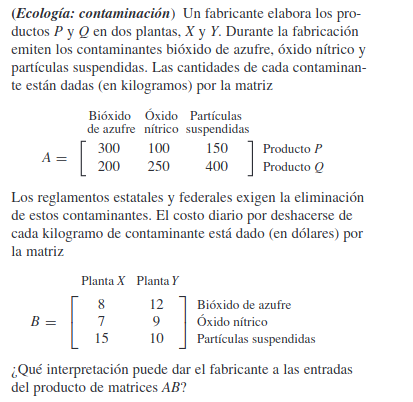
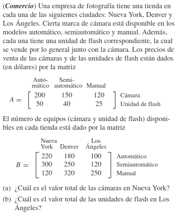

### Taller de Álgebra Lineal

#### T.1. Sea $x$ un $n$-vector.
(a) ¿Es posible que $x \cdot x$ sea negativo? Explique.  
(b) Si $x \cdot x = 0$, ¿cuál es el valor de $x$?

#### T.2. Sean $a$, $b$ y $c$ $n$-vectores, y sea $k$ un número real.
(a) Demuestre que $a \cdot b = b \cdot a$.  
(b) Demuestre que $(a + b) \cdot c = a \cdot c + b \cdot c$.  
(c) Demuestre que $(ka) \cdot b = a \cdot (kb) = k(a \cdot b)$.

#### T.3. 
(a) Demuestre que si $A$ tiene una fila de ceros, $AB$ tiene una fila de ceros.  
(b) Demuestre que si $B$ tiene una columna de ceros, $AB$ tiene una columna de ceros.

#### T.4. Demuestre que el producto de dos matrices diagonales es una matriz diagonal.

#### T.5. Demuestre que el producto de dos matrices escalares es una matriz escalar.

#### T.6. 
(a) Demuestre que el producto de dos matrices triangulares superiores es una matriz triangular superior.  
(b) Demuestre que el producto de dos matrices triangulares inferiores es una matriz triangular inferior.

#### T.7. Sean $A$ y $B$ matrices diagonales de $n \times n$. ¿Es cierto que $AB = BA$? Justifique su respuesta.
**Nota**  Una matr

